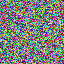

# PPM6: Portable Pixmap Format Library (P6)
This single header library manages PPM files using C code, aswell as to hide text inside of images

## How does it work?
Every `.ppm` image consists of many pixels, let's take for example this image:



This is a 64x64 ppm image generated by code by randomizing each property of a pixel (Since a pixel is in RGB format)

Code:
```c
#include "ppm6.h"
#include <time.h> // For seed, rand_r...

// Width and height of our image
#define WIDTH 64
#define HEIGHT 64

// Function-like macro to get random integer between a range
#define GET_RAND_INT(MIN, MAX, SEED) (unsigned char) rand_r(SEED) % (MAX - MIN + 1) + MIN

int main(void) {
    // Used for randomisation
	int seed = time(0);

    // Initializing an image struct
	struct PPM6_Image img = {0};

    // Some error handling
	if (PPM6_init_image(&img, WIDTH, HEIGHT) != 0) {
		fprintf(stderr, "Error initializing PPM6 image\n");
        // Return failure
		return -1;
	}

    // Iterating over the image
	for (size_t x = 0; x < img.width; x++) {
		for (size_t y = 0; y < img.height; y++) {
			
            // Getting random int from 0 to 255 for pixels
            unsigned char random_r = GET_RAND_INT(0, 255, &seed);
			unsigned char random_g = GET_RAND_INT(0, 255, &seed);
			unsigned char random_b = GET_RAND_INT(0, 255, &seed);
			
            // Initializing the random pixel
            struct PPM6_Pixel pixel = SET_PIXEL(
				random_r, random_g, random_b
			);

            // Setting the pixel into the image struct (x and y are coordinates of where the pixel is placed)
			PPM6_set_pixel(&img, &pixel, x, y);
		}
	}

    // Saving the image into a file
	if (PPM6_save_image("output.ppm", &img) != 0) {
		fprintf(stderr, "Could not save to file\n");
	}

    // Deallocating the image
	PPM6_free_image(&img);

    // Return success
	return 0;
}
```

## How can I store strings?
One way is to take the string, devide it into triplets then make them pixels, for example consider this string:

"ABCDEFGHIJKFMNOP"

This string can be devided into pixels, because each character represents an integer (using [ASCII](https://fr.wikipedia.org/wiki/Fichier:ASCII-Table-wide.svg))

```
Pixel 1: "ABC" -> (65, 66, 67)
Pixel 2: "DEF" -> (68, 69, 70)
Pixel 3: "GHI" -> (71, 72, 73)
...
```

But there is a function that does the job:

```c
#include "ppm6.h"

int main(void) {
	const char *str = "Hello this is a bit of a long string in C that is used to store it into a ppm file, have a great day";
	
    // Variable that stores the number of pixels needed
    size_t number_of_pixels = 0;
	
    // Initializing our image struct
    struct PPM6_Image img = {
		.height = 1, // The height is initialized to 1 so the image can be a horizontal chain of pixels
        // You can choose another way to do it
		.data = PPM6_str_to_pixels(str, &number_of_pixels), // This function takes a string (and a memory adress of a size_t variable) so it returns the array of pixels
	};
	img.width = number_of_pixels; // Now you set the width of the picture to be the number of pixels needed
	PPM6_save_image("output-2.ppm", &img);
	PPM6_free_image(&img);
    return 0;
}
```


## How can I get the strings?
```c
#include "ppm6.h"

int main(void) {
	struct PPM6_Image img = {0};
	PPM6_load_image("images/output-2.ppm", &img);
	char *hidden_message = PPM6_image_to_str(&img); // Turns image into a string
	printf("%s\n", hidden_message);
	free((void*)hidden_message);
	PPM6_free_image(&img);
	return 0;
}
```

Output:
```
Hello this is a bit of a long string in C that is used to store it into a ppm file, have a great day
```

# License
Mit license
